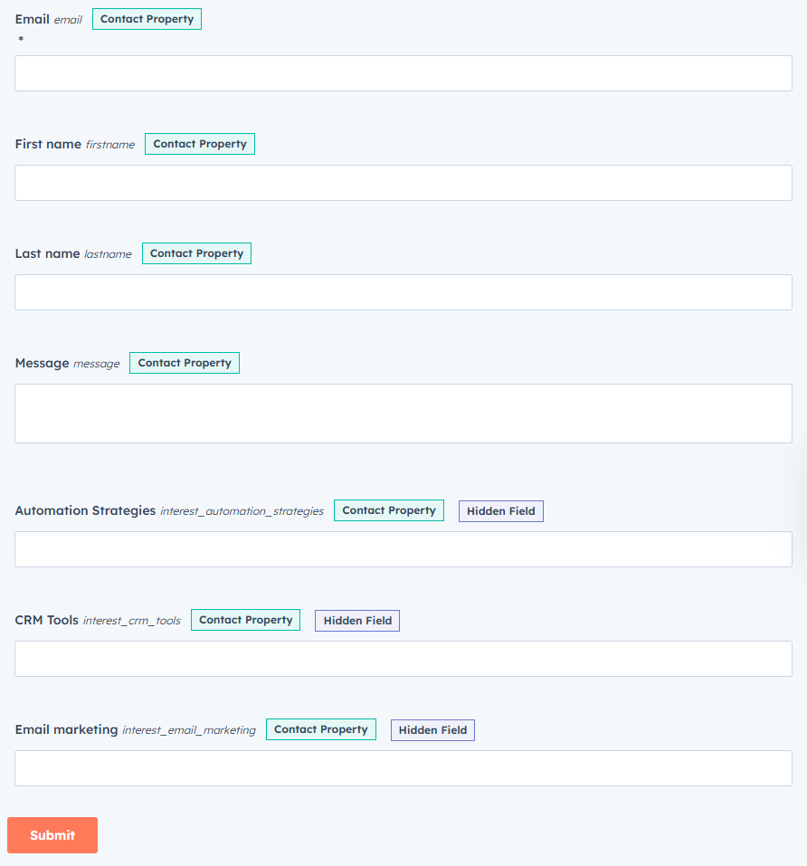
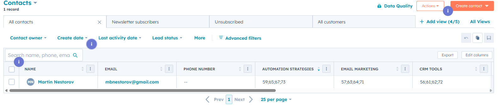
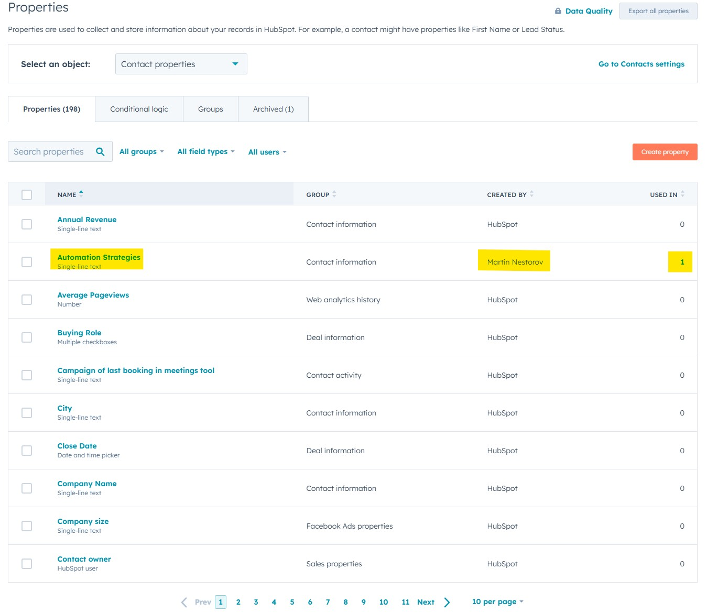
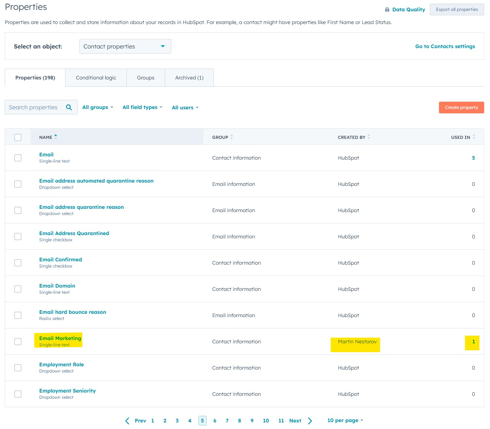
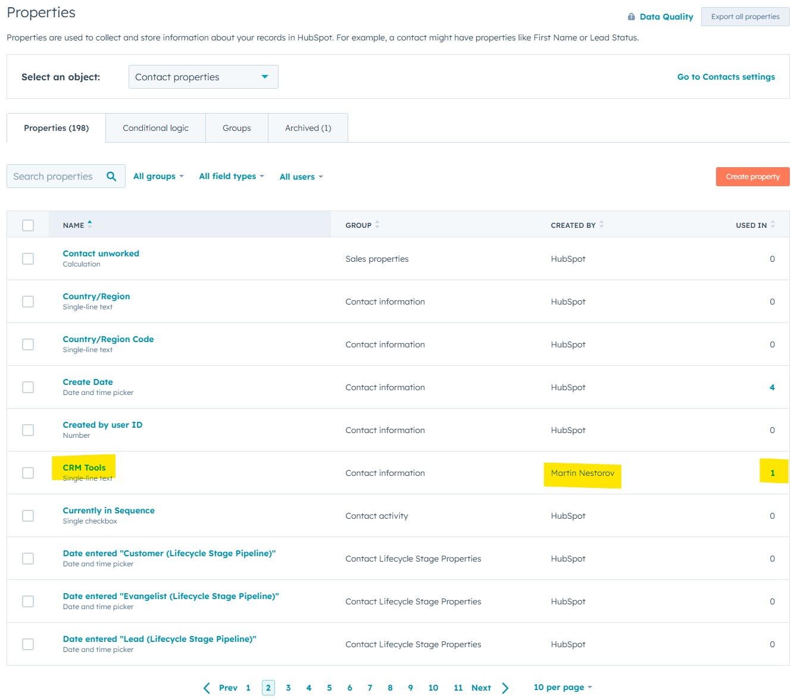
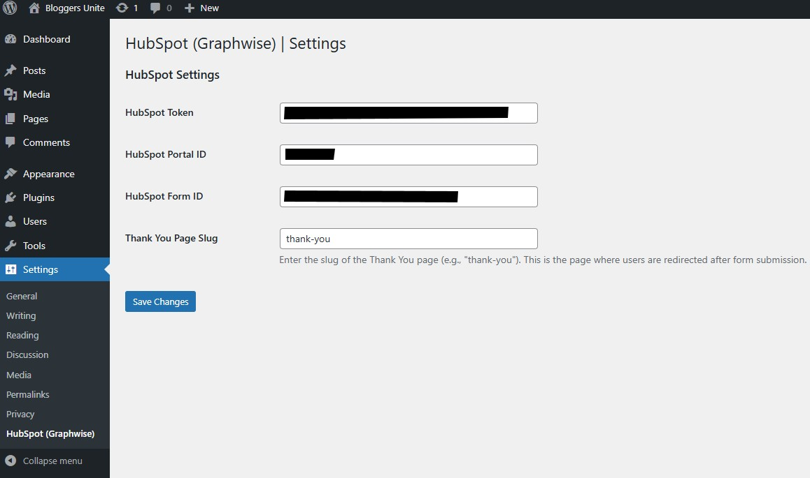
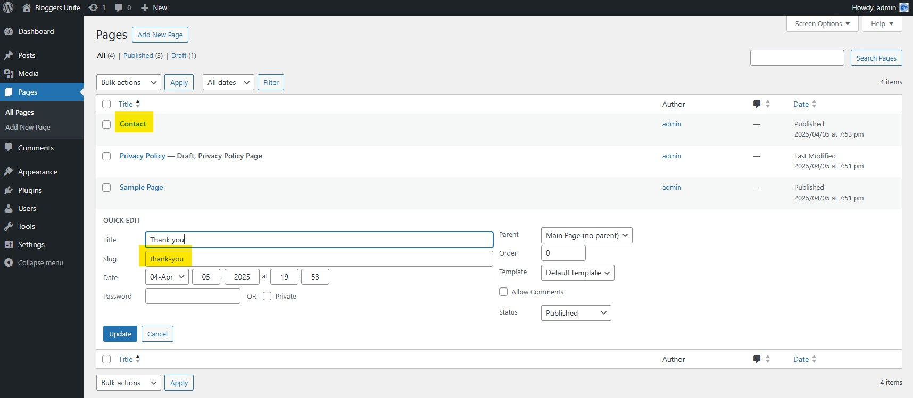
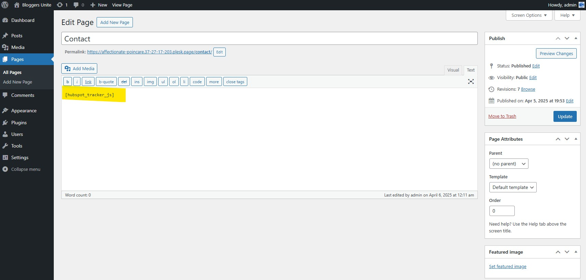
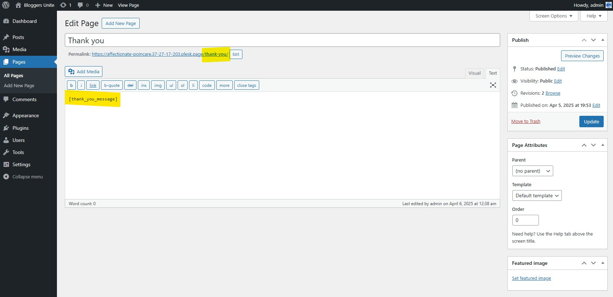
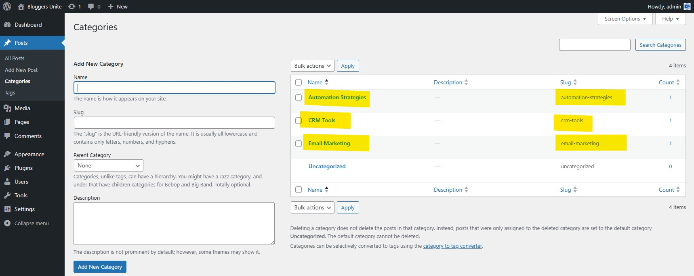

# Graphwise - HubSpot Automation Integration

The **Graphwise - HubSpot Automation Integration** plugin is a powerful all-in-one solution that connects your **WordPress site** with **HubSpot** and other external systems for:

1. Displaying submitted user information on a **personalized Thank You page**
2. Tracking visitor interest in your WordPress **categories**
3. Receiving webhooks from an **Academy system**, updating contacts in HubSpot, and triggering a **Certificate API**

This plugin requires no coding skills. All you need is a WordPress website, a HubSpot account, and a few basic setup steps.

---

## Plugin Features

### 1. Personalized Thank You Page
When a visitor fills out a HubSpot form on your WordPress site, they are redirected to a "Thank You" page where their **first name, last name, and email** are displayed dynamically.

- The slug of the Thank You page (e.g., `/thank-you`) is configurable in the plugin settings.
- The Thank You message is inserted into the page content using the `[thank_you_message]` shortcode, allowing you to control its placement.

### 2. Category Interest Tracking
The plugin keeps track of which content categories a visitor views. When the user fills out the HubSpot form, their **interest in different topics** is sent to HubSpot using hidden fields.

- Tracks categories when a visitor views single posts or category archive pages.
- Stores category visit counts in the browser's `localStorage`.
- Adds hidden fields (e.g., `interest_email_marketing`) to the HubSpot form with the number of visits to each category.
- Allows you to better understand what your leads care about directly inside HubSpot.

### 3. Course Completion Integration (Webhook Support)
When a user completes a course in an external **Academy platform**, it sends a **webhook** to your WordPress site:
- The contact’s record in HubSpot is updated with the latest course completed (stored in the `latest_completed_course` property).
- A **Certificate API** is triggered to issue their course completion certificate.

### 4. Organized Code with Separate JavaScript Files
- JavaScript code is organized into separate files (`footer-scripts.js` for category tracking and Thank You page logic, `hubspot-tracker.js` for HubSpot form integration).
- Scripts are properly enqueued using WordPress best practices (`wp_enqueue_script`).
- Dynamic data (e.g., category slugs, HubSpot Portal ID, and Form ID) is passed to the scripts using `wp_localize_script`.

---

## How to Set It Up

### Prerequisites
- A working **WordPress website**.
- Access to your **HubSpot account**.
- A HubSpot **form with redirect** to a Thank You page.
- Optionally: an external **Academy system** that can send webhooks.

---

## Set Up in WordPress

### 1. Install the Plugin
- **Log in to your WordPress admin dashboard**.
- Go to **Plugins > Add New > Upload Plugin**.
- Upload the plugin ZIP file: `graphwise-hubspot-automation-integration.zip`.
- Click **Activate Plugin**.

### 2. Create Categories (for Interest Tracking)
- **Go to Posts > Categories**.
- Create at least 3 categories that match topics you write about, like:
  - `email-marketing`
  - `crm-tools`
  - `automation-strategies`
- These category slugs (e.g., `email-marketing`) will be used as the keys to track visitor interests (e.g., `interest_email_marketing` in HubSpot).
- **Important:** Make sure your blog posts are assigned to these categories so the plugin can track what users are reading.

### 3. Create the Thank You Page
- **Go to Pages > Add New**.
- Title it: `Thank You` (or another title, but note the slug, e.g., `thank-you`).
- In the content editor, add the following shortcode where you want the Thank You message to appear:

```html
[thank_you_message]

```
- Publish the page.

**Note:** The page slug (e.g., `thank-you`) as you’ll need to configure it in the plugin settings.

### 4. Create the Contact Page (with HubSpot Form)
- **Go to Pages > Add New**
- Title it: `Contact`
- In the content editor, add:

```html
[hubspot_tracker_js]
```
- Publish the page.

---

## Configure the Plugin Settings

1. Go to **Settings > Graphwise**
2. Fill in the following:

   | Field                    | What to Enter                                                                                             |
   |--------------------------|-----------------------------------------------------------------------------------------------------------|
   | **HubSpot Token**        | Your HubSpot Private App token. Generate it in HubSpot → Settings → Integrations                          |
   | **Portal ID**            | Your HubSpot portal ID (find in form embed code)                                                          |
   | **Form ID**              | Your HubSpot form ID (find in form embed code)                                                            |
   | **Thank You Page Slug**  | The slug of your Thank You page (e.g., thank-you). This must match the slug of the page created in Step 3.|

3. Click **Save Changes**

---

## Create a HubSpot Form

1. In your **HubSpot dashboard**, go to:
   **Marketing > Lead Capture > Forms**
2. Create a **New Form** with fields like:
   - First Name (name: `firstname`)
   - Last Name (name: `lastname`)
   - Email (name: `email`)
   - Hidden fields for category interests (e.g., `interest_email_marketing`, `interest_crm_tools`, `interest_automation_strategies`).
      - These fields should be created in HubSpot as Number type properties under Contacts > Properties.
      - The plugin will automatically populate these fields with the number of visits to each category.
3. Under **Options**, set **Redirect to another page** and enter the URL of your WordPress **Thank You** page (e.g., `/thank-you`)
4. Click **Publish**
5. Go to **Share > Embed**, and find your:
   - `portalId`
   - `formId`
6. Copy these values and paste them into the plugin settings in WordPress (Step 5 above).

---

## Test the Plugin

### 1. Test Category Interest Tracking
- Visit several blog posts or category archive pages on your WordPress site (e.g., posts in the email-marketing or crm-tools categories).
- Open the browser console (DevTools > Console) and look for logs like:

```
Updated visited categories: { "email-marketing": 2, "crm-tools": 1 }
```
- This confirms that the plugin is tracking category visits in `localStorage`.

### 2. Test the HubSpot Form and Thank You Page
- Go to your Contact page (e.g., yoursite.com/contact).
- Fill out and submit the HubSpot form.
- Ensure you’re redirected to the Thank You page (e.g., yoursite.com/thank-you).
- Verify that the Thank You message appears in the location where you placed the `[thank_you_message]` shortcode, displaying the submitted data (e.g., "Thank you, Jane Doe! Confirmation sent to: jane.doe@example.com").
- Check the console for logs like:

```
Retrieved data on Thank You page: {"firstName":"Jane","lastName":"Doe","email":"jane.doe@example.com"}
```
- In HubSpot, go to **CRM > Contacts**, find the contact by email, and confirm that the `interest_*` properties (e.g., `interest_email_marketing`) are populated with the number of category visits.

### 3. Test the Course Completion Webhook
You can simulate a course completion webhook using Postman or any API testing tool.

**Step-by-Step Instructions**
1. Open Postman or your preferred API client.
2. Set the method to POST.
3. Use this URL: `https://yourdomain.com/wp-json/graphwise/v1/course-complete`
   - Replace yourdomain.com with your WordPress site's domain.
   - If you're using **Local by Flywheel**, enable **Live Link** and use the public URL provided by Local.
4. Go to the Body tab, select raw, and choose JSON format.
5. Paste the following sample JSON:

```json
{
  "email": "jane.doe@example.com",
  "course_name": "Advanced Automation Strategy"
}
```
6. Add a header for authentication (since the endpoint requires `edit_posts` capability):
- If testing locally, you can log in to WordPress as an admin, copy the `wordpress_logged_in_*` cookie from your browser, and add it to Postman under Cookies.
- Alternatively, use a nonce-based authentication method if integrating with an external system.
7. Click Send.

#### What Happens After Sending the Request?

**The plugin will:**
- Search for the contact in HubSpot by the provided email.
- Update their profile with the `latest_completed_course` property (e.g., `Advanced Automation Strategy`).
- Trigger a mock certificate API call to `https://certificate-api.com/generate` (replace this URL with your actual certificate API endpoint).

**Expected Response:**

```json
{
  "status": "success"
}
```
**Verify in HubSpot:**

- Go to **CRM > Contacts**.
- Find the contact by email (e.g., jane.doe@example.com).
- Check that the `latest_completed_course` property is updated to `Advanced Automation Strategy`.

---

## Plugin Files

**The plugin is structured as follows:**

graphwise-hubspot-automation-integration/
├── gw-hubspot-automation-integration.php  # Main plugin file
└── js/
      ├── footer-scripts.js   # Handles category tracking and Thank You page logic
      └── hubspot-tracker.js  # Handles HubSpot form rendering and category interest injection

---

## Advanced Configuration

1. Styling the Thank You Message
You can style the Thank You message by targeting the #thank-you-message container in your theme’s CSS or a custom CSS plugin. 

**Example:**

```css
#thank-you-message {
    text-align: center;
    margin: 20px 0;
}
#thank-you-message h2 {
    color: #2c3e50;
    font-size: 24px;
}
#thank-you-message p {
    color: #7f8c8d;
    font-size: 16px;
}
```

2. Customizing the Certificate API

The plugin calls a placeholder certificate API (https://certificate-api.com/generate). To integrate with your actual certificate system:

- Replace the URL in the `graphwise_handle_webhook` function with your certificate API endpoint.
- Update the request body if your API requires additional fields.

---

## Troubleshooting
1. Thank You Message Not Appearing
- Ensure the [thank_you_message] shortcode is added to the Thank You page content.
- Verify that the **Thank You Page Slug** in **Settings > Hubspot** matches the actual slug of your Thank You page (e.g., `thank-you`).
- Check the browser console for errors related to sessionStorage.getItem("hubspot_submitted_data").
- Confirm that footer-scripts.js is loaded (check the Network tab in DevTools).

2. HubSpot Form Not Loading
- Verify that the `portalId` and `formId` in **Settings > Hubspot** match your HubSpot form’s values.
- Check the console for errors related to `hbspt.forms.create`.
- Ensure `hubspot-tracker.js` and `v2.js` (HubSpot forms script) are loaded (check the Network tab in DevTools).

3. Category Interests Not Appearing in HubSpot
- Ensure you’ve created the corresponding properties in HubSpot (e.g., `interest_email_marketing`) as `Number` type properties.
- Verify that the category slugs on your WordPress site match the property names in HubSpot (e.g., a category slug `email-marketing` maps to `interest_email_marketing`).
- Check the console for logs like `Set hidden fields for categories: {...}` when submitting the form.

4. Webhook Not Working
- Ensure your WordPress site is publicly accessible (e.g., enable Live Link in Local by Flywheel if testing locally).
- Verify that the HubSpot token in Settings > Graphwise is valid.
- Check the response in Postman for errors (e.g., authentication issues if the user doesn’t have `edit_posts` capability).

---

## Screenshots (HubSpot)

### Form Fields


### Form Options (Redirect)
")

### Contact Submissions


### Properties
#### 1. Automation Strategies

#### 2. Email Marketing

#### 3. CRM Tools


---

## Screenshots (WordPress)

### Back-end

#### 1. Plugin Settings Page

#### 2. WordPress Pages

#### 3. Contact page

#### 4. Thank you page

#### 5. WordPress Categories



### Front-end

#### 1. WordPress Front-end (Contact page)
")

#### 2. WordPress Front-end (Thank you page)
")

#### 3. WordPress Front-end (Track categories)
")